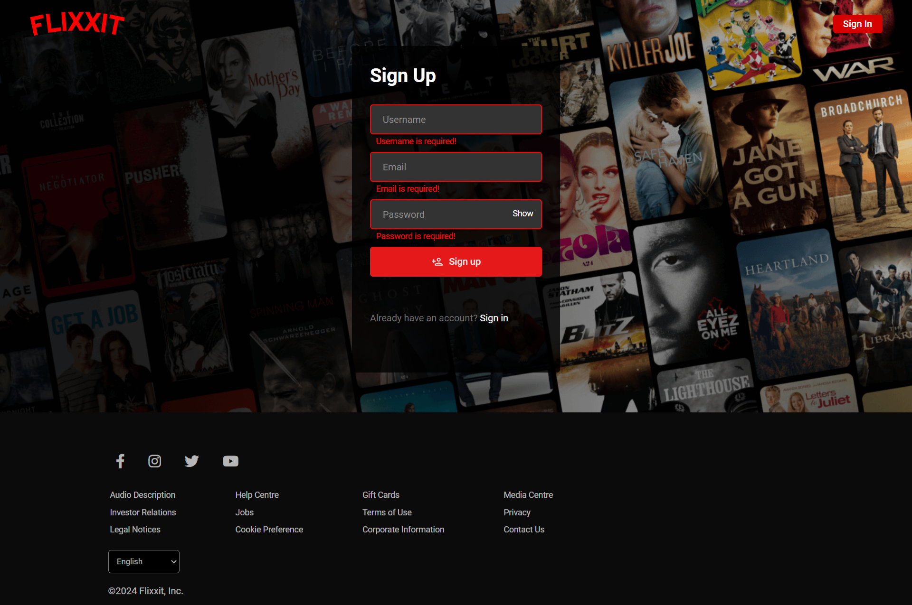
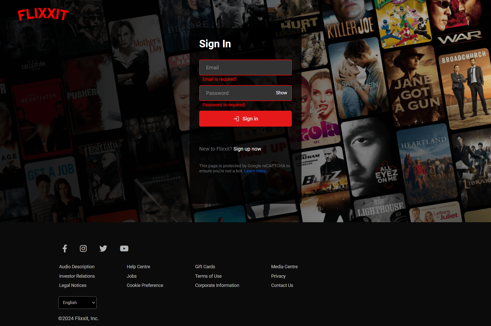
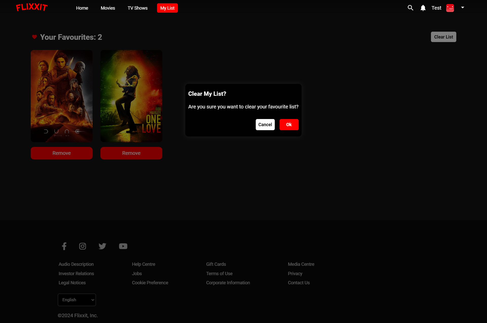
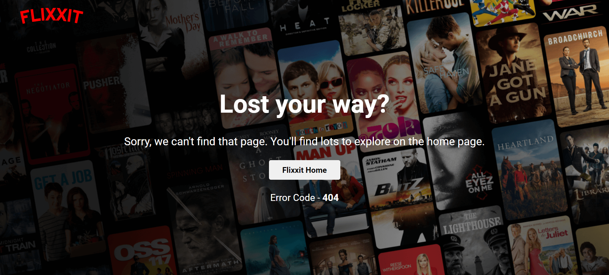

<div align="center">
  <a href="https://github.com/Amar7021/Flixxit-MERN-Movie-App">
    
  </a>
<h3 align="center">Flixxit - Movie App</h3>
  <p align="center">
    A FULLSTACK MERN Movie App 2024
    <br />
    <br />
    <a href="https://flixxit-movie-app.vercel.app">View website</a>
    <br />
    <br />
  </p>
</div>

## Key Features

1. **User Authentication:**

   - Users can create accounts, log in, and authenticate themselves to personalize their experience.

2. **Favorite Management:**

   - Add movies and TV shows to your favorites for quick access to preferred content.

3. **Media Playback:**

   - Enjoy seamless streaming of movies and TV shows with user-friendly media playback options.

4. **Redux for State Management:**

   - Utilizes Redux for efficient state management, ensuring a consistent and scalable user experience.

5. **Persistent State:**

   - Redux is employed for persisting state, retaining user data and preferences across sessions.

6. **MERN Stack Implementation:**

   - Built using the MERN stack (MongoDB, Express.js, React, Node.js) for a robust and modern web application.

7. **Responsive Design:**

   - Designed with responsiveness in mind, providing an optimal viewing experience on various devices.

8. **API Integration:**

   - Integrates third-party APIs to fetch comprehensive movie and TV show data, enhancing content variety.

9. **Error Handling:**
   - Implements robust error-handling mechanisms for a smooth user experience, even in unforeseen circumstances.

## Resources

- [MongoDB](https://www.mongodb.com)
- [Express](https://expressjs.com)
- [React.js](https://react.dev)
- [Redux](https://redux.js.org)
- [Node.js](https://nodejs.org)
- [Mongoose](https://mongoosejs.com)
- [Material UI](https://mui.com)
- [SASS](https://sass-lang.com)
- [JSON Web Token](https://jwt.io)
- [Axios](https://axios-http.com)
- [Formik](https://formik.org)
- [Yup](https://www.npmjs.com/package/yup)
- [React Loading Skeleton](https://www.npmjs.com/package/react-loading-skeleton)
- [React Hot Toast](https://react-hot-toast.com/)
- [React Select](https://react-select.com/home)
- [React Infinite Scroll](https://www.npmjs.com/package/react-infinite-scroll-component)
- [React Lazy Loading Image](https://www.npmjs.com/package/react-lazy-load-image-component)
- [React Circular Progress Bar](https://www.npmjs.com/package/react-circular-progressbar)
- [Dayjs](https://www.npmjs.com/package/dayjs)
- [React Slick](https://react-slick.neostack.com)
- [React Player](https://www.npmjs.com/package/react-player)

## Preview

  
  
  
  
  


## Getting Started

To get a local copy up and running follow these simple steps.

### Installation

- Clone the repository

```
git clone https://github.com/Amar7021/Flixxit-MERN-Movie-App.git
```

- Install NPM packages

```
cd server
npm install  // to install API dependencies
cd ..
cd client
npm install  // to install client dependencies
```

- Run server and client

```
cd server
npm start  // to start server
cd ..
cd client
npm start  // to start client side
```

## How to use

- [Signup](https://flixxit-movie-app.vercel.app/signup): at first user needs to register using email, username and password.
- [Signin](https://flixxit-movie-app.vercel.app/signin): user needs to login with the credentials used for registeration i.e email and password.
- User can enjoy streaming TV Shows and movies of his choice and also select the genre type and consume the content. User just needs to click the 'Play' button on any of the movies or tv shows to 'Watch' it.
- User can logout from the dropdown menu listed on the top right corner.

## Deployment:

This application is deployed using [Vercel](https://vercel.com), a cloud platform for static sites and serverless functions. Follow the steps below to deploy the application to Vercel:

1. **Create a Vercel Account:** Sign up for a Vercel account if you haven't already.
2. **Install Vercel CLI:** Install the Vercel CLI by running `npm install -g vercel` in your terminal.
3. **Deploy:** Run `vercel` in the root directory of your project and follow the prompts to deploy your application.

## Cold Start Issue

During deployment on Vercel, I encountered a cold start issue where the application experienced longer loading times initially. This is a common issue with serverless functions on various platforms.

### Tips for Handling Cold Starts

Based on my experience, here are some tips for handling cold starts on Vercel:

- Monitor Performance: Regularly monitor application performance and cold start times to identify any issues and optimize as needed.
- Community Support: Engage with the Vercel community and forums to learn from others' experiences and find additional tips for optimizing deployments.

## Connect with me

[LinkedIn](https://www.linkedin.com/in/amar-belkar-7806101b2/)  
[Gmail](mailto:amarhere1122@gmail.com)
